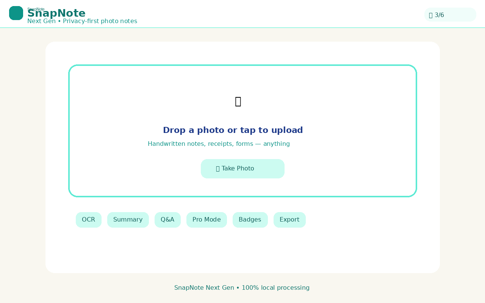

# SnapNote

[](https://github.com/MiMindMendinc/SnapNote/actions/workflows/ci.yml)
[](https://github.com/MiMindMendinc/SnapNote/actions/workflows/pages.yml)
[](LICENSE)
[](manifest.json)
[](docs/PRIVACY.md)
[](docs/OFFLINE.md)
[](https://mimindmendinc.github.io/SnapNote/)

**Privacy-first photo-to-notes and summarization — Next Gen edition.**

SnapNote is a Michigan MindMend Inc. portfolio project exploring how families, caregivers, students, and community workers can turn photos or documents into cleaner notes, summaries, and question-answering workflows with a privacy-first design.

**Live demo:** https://mimindmendinc.github.io/SnapNote/



---

## What's New in Next Gen

- **Achievement badges** — unlock 6 badges as you use SnapNote
- **Pro Mode** — auto-generated headlines and Spanish translation summaries
- **Export & copy** — copy any section or download a `.txt` export
- **Bundled OCR** — Tesseract.js + English language data shipped locally (~16 MB, no CDN)
- **Local CSS** — no Tailwind CDN; styles bundled in `assets/css/app.css`
- **PWA icons** — installable app shell with 192/512 icons
- **CI smoke tests** — 35+ automated checks on every push and PR
- **GitHub Pages** — auto-deployed live demo
- **Full docs** — privacy policy, offline checklist, and use cases

---

## Features

- **Photo-to-text extraction** (Tesseract.js OCR, bundled locally)
- **Summary and keyword extraction**
- **Question-answering** over captured text (local keyword matching)
- **Pro Mode** — headlines + offline Spanish translation
- **Achievement badges** — gamified progress in `localStorage`
- **Export** — download notes as plain text
- **Installable PWA** — add to home screen on mobile and desktop
- **Offline-capable** — after first load, app shell + OCR assets cache via service worker

---

## Quick Start

```bash
git clone https://github.com/MiMindMendinc/SnapNote.git
cd SnapNote
npx --yes serve .
# Open http://localhost:3000
```

Or use the live demo: **https://mimindmendinc.github.io/SnapNote/**

### Run smoke tests

```bash
node scripts/smoke-test.js
```

---

## Achievements

| Badge | How to unlock |
|-------|---------------|
| 📸 First Snap | Upload your first photo |
| 📝 Text Master | Extract text with OCR |
| ❓ Smart Ask | Ask a question about your note |
| ⭐ Pro User | Enable Pro Mode and process a note |
| 📲 Installed | Install SnapNote as a PWA |
| 🏆 Power User | Unlock all other badges |

---

## Documentation

| Doc | Description |
|-----|-------------|
| [PRIVACY.md](docs/PRIVACY.md) | Privacy model and data handling |
| [OFFLINE.md](docs/OFFLINE.md) | Offline dependency checklist |
| [USE-CASES.md](docs/USE-CASES.md) | School, family, and caregiver examples |

---

## Architecture

```text
Image / Document
   ↓
OCR extraction (bundled Tesseract.js + eng.traineddata.gz)
   ↓
Clean text notes + summary + keywords
   ↓
Pro Mode: headline + translation (optional)
   ↓
Q&A workflow + export
   ↓
Achievement badges (localStorage)
```

---

## Privacy Model

SnapNote processes photos **in your browser**. There is no SnapNote server in the default deployment. See [docs/PRIVACY.md](docs/PRIVACY.md) for the full policy and [docs/OFFLINE.md](docs/OFFLINE.md) for the deployment checklist.

---

## What It Does Not Claim

- medical, legal, or financial advice
- perfect OCR accuracy
- certified privacy/security compliance
- professional-grade translation

---

## Roadmap — Complete

- [x] Add simple browser smoke test
- [x] Add PWA icons (192/512)
- [x] Add achievement badges
- [x] Add CI workflow with badge
- [x] Add screenshots
- [x] Add offline dependency checklist
- [x] Bundle required assets locally
- [x] Add `docs/PRIVACY.md`
- [x] Add live demo (GitHub Pages)
- [x] Add example use cases for school, family, and caregiver workflows

---

## Built By

**Lyle Perrien II**  
Founder, **Michigan MindMend Inc.**  
Michigan

Building privacy-first, offline-capable AI tools for families, communities, and trust-sensitive environments.

## License

MIT
